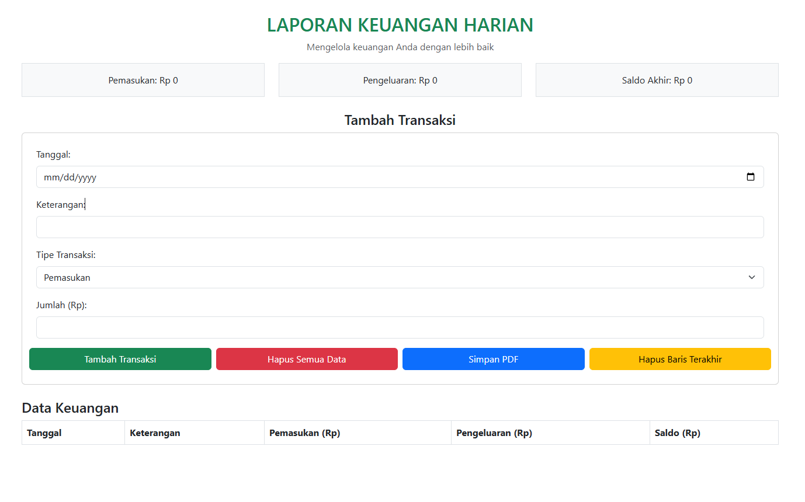

# Aplikasi Laporan Keuangan Harian

## Deskripsi
Aplikasi web laporan keuangan harian sederhana ini dirancang untuk membantu pengguna mencatat, mengelola, dan memantau arus kas harian secara efisien dan mudah digunakan. Aplikasi ini memungkinkan pencatatan transaksi pemasukan dan pengeluaran secara real-time, sehingga pengguna dapat melihat kondisi keuangan secara akurat setiap hari.

## Instalasi 
Aplikasi dapat langsung di akses pada link berikut 
  [https://darrield.github.io/aplikasi-laporan-keuangan/](https://darrield.github.io/aplikasi-laporan-keuangan/)

## Gambar Aplikasi

## Kontak
Email : darrieldapples@gmail.com
